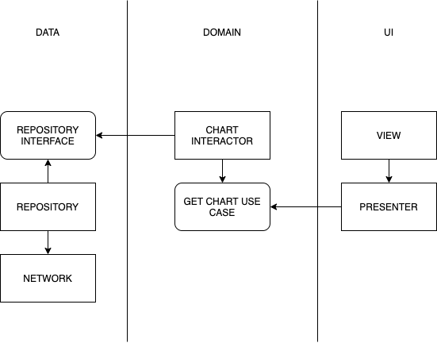

####

Application to view Bitcoin statistics from https://www.blockchain.com. 

#### Archtecture

For the architecture I decided to use CLEAN architecture with MVP used as UI architectural pattern. The repository class is used to separate network fetching and response model mapping. Use cases are implemented by Interactor, which is mainly used as a proxy to repository, due to the simplicity of the logic inside it. The presenter calls the use case to fetch recipes.

The project is separated into 5 modules:
* `app` - contains core DI implementation, application class, and UI test.
* `base-ui` - All logic and classes related to UI layer, such as screens, presenters, and adapters. This module can be further modularized into different `feature-ui` modules.
* `data` - Implementations of repositories and interactors. Also, network-related logic. 
* `domain` - Domain-specific classes and use case interfaces.
* `test-utils` - Helper module that contains dependencies to testing libraries and some helpful classes.

#### Testing
Due to the usage of dependency injection and single responsibility principle, almost every class and logic in the project are easily testable by unit tests. Activity, adapters, and viewholders are not tested with unit tests because they don't contain any significant logic.
For UI testing I used Kaspresso framework that heavily abstracts boilerplate Espresso code.

#### Libraries

* [Retrofit 2](https://square.github.io/retrofit/ "Retrofit 2") - Networking
* [RxJava 2](https://github.com/ReactiveX/RxJava "RxJava 2") - Threading
* [MPAndroidChart](https://github.com/PhilJay/MPAndroidChart "MPAndroidChart") - Charting library
* [Dagger 2](https://github.com/google/dagger "Dagger 2") - Dependency injection
* [Moxy](https://github.com/moxy-community/Moxy "Moxy") - MVP implementation + Config changes handling
* [AssertK](https://github.com/willowtreeapps/assertk) - Kotlin assertion library
* [MockK](https://mockk.io/) - Kotlin mocking library
* [Kaspresso](https://github.com/KasperskyLab/Kaspresso) - UI Testing
